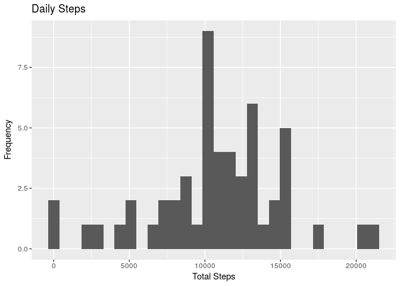
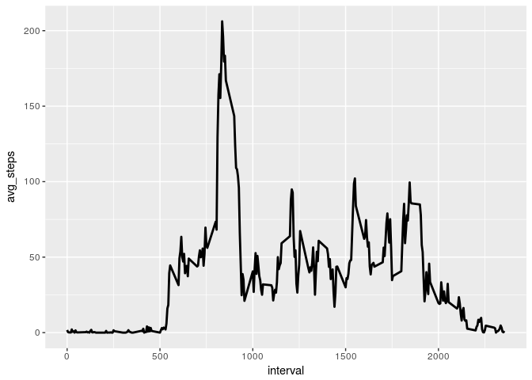
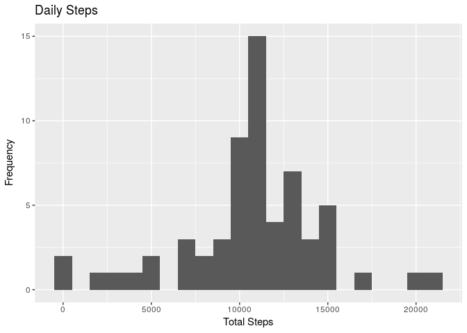
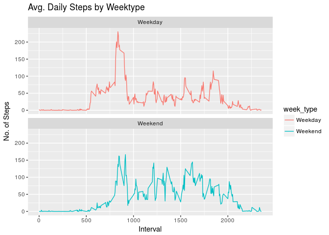

Reproducible Research Course Project 1
================
Soham Lawar
22 April 2017

Loading and preprocessing the data
----------------------------------

1.  Code for reading in the dataset and/or processing the data

``` r
library(ggplot2)
library(dplyr)
```

    ## 
    ## Attaching package: 'dplyr'

    ## The following objects are masked from 'package:stats':
    ## 
    ##     filter, lag

    ## The following objects are masked from 'package:base':
    ## 
    ##     intersect, setdiff, setequal, union

``` r
activity_data <- read.csv("/home/soham/activity.csv")
summary(activity_data)
```

    ##      steps                date          interval     
    ##  Min.   :  0.00   2012-10-01:  288   Min.   :   0.0  
    ##  1st Qu.:  0.00   2012-10-02:  288   1st Qu.: 588.8  
    ##  Median :  0.00   2012-10-03:  288   Median :1177.5  
    ##  Mean   : 37.38   2012-10-04:  288   Mean   :1177.5  
    ##  3rd Qu.: 12.00   2012-10-05:  288   3rd Qu.:1766.2  
    ##  Max.   :806.00   2012-10-06:  288   Max.   :2355.0  
    ##  NA's   :2304     (Other)   :15840

``` r
str(activity_data)
```

    ## 'data.frame':    17568 obs. of  3 variables:
    ##  $ steps   : int  NA NA NA NA NA NA NA NA NA NA ...
    ##  $ date    : Factor w/ 61 levels "2012-10-01","2012-10-02",..: 1 1 1 1 1 1 1 1 1 1 ...
    ##  $ interval: int  0 5 10 15 20 25 30 35 40 45 ...

``` r
dim(activity_data)
```

    ## [1] 17568     3

``` r
activity_data$date <- as.Date(activity_data$date)
```

What is mean total number of steps taken per day?
-------------------------------------------------

1.  Histogram of the total number of steps taken each day

``` r
Total_steps <- activity_data %>%group_by(date)%>%filter(!is.na(steps))%>%summarise(total_steps = sum(steps, na.rm=TRUE))
head(Total_steps)
```

    ## # A tibble: 6 × 2
    ##         date total_steps
    ##       <date>       <int>
    ## 1 2012-10-02         126
    ## 2 2012-10-03       11352
    ## 3 2012-10-04       12116
    ## 4 2012-10-05       13294
    ## 5 2012-10-06       15420
    ## 6 2012-10-07       11015

``` r
ggplot(Total_steps,aes(x=total_steps))+geom_histogram()+labs(x="Total Steps",y = "Frequency",title = "Daily Steps")
```

    ## `stat_bin()` using `bins = 30`. Pick better value with `binwidth`.



1.  Mean and median number of steps taken each day

``` r
mean_toatal_steps <-mean(Total_steps$total_steps)
mean_toatal_steps
```

    ## [1] 10766.19

``` r
median_total_steps <- median(Total_steps$total_steps)
median_total_steps
```

    ## [1] 10765

\`\`\`

To calculate mean total number of steps per day row's having 'steps' Not Available(NA) are not considered. \#\# What is the average daily activity pattern?

``` r
Interval <- activity_data %>%group_by(interval)%>%filter(!is.na(steps))%>%summarise(avg_steps = mean(steps))
head(Interval)
```

    ## # A tibble: 6 × 2
    ##   interval avg_steps
    ##      <int>     <dbl>
    ## 1        0 1.7169811
    ## 2        5 0.3396226
    ## 3       10 0.1320755
    ## 4       15 0.1509434
    ## 5       20 0.0754717
    ## 6       25 2.0943396

4)Time series plot of the average number of steps taken

``` r
ggplot(Interval,aes(x=interval,y = avg_steps))+geom_line(size = 1)
```



1.  The 5-minute interval that, on average, contains the maximum number of steps

``` r
Interval[which.max(Interval$avg_steps),]
```

    ## # A tibble: 1 × 2
    ##   interval avg_steps
    ##      <int>     <dbl>
    ## 1      835  206.1698

Imputing missing values
-----------------------

1.  Code to describe and show a strategy for imputing missing data

To impute missing values following stratigy is used :- 1) Average number of steps are calculated for each interval 2) Not Available(NA) values are imputed by respective average number of steps for that particular interval.

``` r
sum(is.na(activity_data$steps))
```

    ## [1] 2304

``` r
activity_data_2 <- activity_data
nas <- is.na(activity_data_2$steps)
avg_interval <- tapply(activity_data_2$steps,activity_data_2$interval,mean,na.rm = TRUE)
activity_data_2$steps[nas] <- avg_interval[as.character(activity_data_2$interval[nas])]
names(activity_data_2)
```

    ## [1] "steps"    "date"     "interval"

``` r
sum(is.na(activity_data_2))
```

    ## [1] 0

``` r
activity_data_2<- activity_data_2[, c("date", "interval", "steps")]
head(activity_data_2)
```

    ##         date interval     steps
    ## 1 2012-10-01        0 1.7169811
    ## 2 2012-10-01        5 0.3396226
    ## 3 2012-10-01       10 0.1320755
    ## 4 2012-10-01       15 0.1509434
    ## 5 2012-10-01       20 0.0754717
    ## 6 2012-10-01       25 2.0943396

``` r
Total_steps_2 <- activity_data_2 %>%group_by(date)%>%filter(!is.na(steps))%>%summarise(total_steps = sum(steps, na.rm=TRUE))
head(Total_steps_2)
```

    ## # A tibble: 6 × 2
    ##         date total_steps
    ##       <date>       <dbl>
    ## 1 2012-10-01    10766.19
    ## 2 2012-10-02      126.00
    ## 3 2012-10-03    11352.00
    ## 4 2012-10-04    12116.00
    ## 5 2012-10-05    13294.00
    ## 6 2012-10-06    15420.00

1.  Histogram of the total number of steps taken each day after missing values are imputed

``` r
ggplot(Total_steps_2,aes(x = total_steps))+geom_histogram(binwidth  = 1000)+labs(x="Total Steps",y = "Frequency",title = "Daily Steps")
```



``` r
mean_toatal_steps_2 <-mean(Total_steps_2$total_steps)
mean_toatal_steps_2
```

    ## [1] 10766.19

``` r
median_total_steps_2 <- median(Total_steps_2$total_steps)
median_total_steps_2
```

    ## [1] 10766.19

Are there differences in activity patterns between weekdays and weekends?
-------------------------------------------------------------------------

1.  Panel plot comparing the average number of steps taken per 5-minute interval across weekdays and weekends

``` r
activity_data_2 <- activity_data_2%>%mutate(week_type = ifelse(weekdays(activity_data_2$date)=="Saturday"|weekdays(activity_data_2$date)=="Sunday","Weekend","Weekday"))

head(activity_data_2)
```

    ##         date interval     steps week_type
    ## 1 2012-10-01        0 1.7169811   Weekday
    ## 2 2012-10-01        5 0.3396226   Weekday
    ## 3 2012-10-01       10 0.1320755   Weekday
    ## 4 2012-10-01       15 0.1509434   Weekday
    ## 5 2012-10-01       20 0.0754717   Weekday
    ## 6 2012-10-01       25 2.0943396   Weekday

``` r
Interval_2 <- activity_data_2 %>%group_by(interval,week_type)%>%filter(!is.na(steps))%>%summarise(avg_steps_2 = mean(steps))
head(Interval_2)
```

    ## Source: local data frame [6 x 3]
    ## Groups: interval [3]
    ## 
    ##   interval week_type avg_steps_2
    ##      <int>     <chr>       <dbl>
    ## 1        0   Weekday  2.25115304
    ## 2        0   Weekend  0.21462264
    ## 3        5   Weekday  0.44528302
    ## 4        5   Weekend  0.04245283
    ## 5       10   Weekday  0.17316562
    ## 6       10   Weekend  0.01650943

``` r
ggplot(Interval_2, aes(x =interval , y=avg_steps_2, color=week_type)) +
  geom_line() +
  labs(title = "Avg. Daily Steps by Weektype", x = "Interval", y = "No. of Steps")+facet_wrap(~week_type, ncol = 1, nrow=2) 
```


